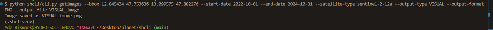

# Sentinel Hub CLI Tool (`shcli`)

A CLI tool to query the Sentinel Hub Catalog and Process APIs for satellite imagery and meta data. This tool enables users to authenticate, fetch satellite images, and retrieve catalog statistics.

---

## **Table of Contents**

1. [Features](#features)
2. [Prerequisites](#prerequisites)
3. [Installation](#installation)
4. [Usage](#usage)
5. [Assumptions](#assumptions)
6. [Testing](#testing)
7. [Examples](#examples)
8. [NextStep](#NextSteps)

---

## **Features**

- **Authentication**: Authenticate with Sentinel Hub API using your Client ID and Client Secret.
- **Catalog Statistics**: Retrieve statistics about available imagery within a specified bounding box and date range.
- **Image Retrieval**: Fetch satellite imagery (e.g., NDVI, Visual) for a given bounding box and date range.
- **Format Support**: Outputs imagery in PNG or TIFF formats.

---

## **Prerequisites**

1. **System Requirements**:

   - **Python**: Version 3.10 or higher.

2. **Sentinel Hub Account**:

   - Obtain a **Client ID** and **Client Secret** from your Sentinel Hub account.

3. **Dependencies**:
   - Install necessary Python libraries (see [Installation](#installation)).

---

## **Installation**

### 1. Clone the Repository

```bash
git clone git@github.com:bismarkade/shcli.git
cd shcli
```

### 2. Create a Virtual Environment

```bash
python -m venv .venv
source .venv/bin/activate
```

### 3. Install Dependencies

```bash
pip install -r requirements.txt
```

### 4. Install the Tool Locally

```bash
pip install -e .
```
### 5. [Optinal] Add Script to path


---

## **Usage**

### Basic Commands

```text
Please run directly with python (if the command does not load directly)
eg python shcli/cli.py <COMMANDS> from the shcli as shown in the example images
```

### **Command Overview Examples**

#### **--help**


#### **auth**


#### **catalog-s**


#### **getimages**


#### **example**


### **Example for Retieving images over Salzburg Airport Area**

#### **Authenticate**

```bash
$ shcli auth --client-id <YOUR_CLIENT_ID> --client-secret <YOUR_CLIENT_SECRET>
or
$ python shcli/cli.py --client-id <YOUR_CLIENT_ID> --client-secret <YOUR_CLIENT_SECRET>
```


This securely saves your credentials for subsequent requests in auth_credentials.json file

#### **Generate Catalog Statistics**

```bash
$ shcli catalog-s --bbox <minLon> <minLat> <maxLon> <maxLat> \
    --start-date <YYYY-MM-DD> --end-date <YYYY-MM-DD>

or

$ python shcli/cli.py catalog-s --bbox <minLon> <minLat> <maxLon> <maxLat> \
    --start-date <YYYY-MM-DD> --end-date <YYYY-MM-DD>
$
```


this will return as summary of Catalog result as in the Sentinel Hub Request builder -Catalog


#### **Retrieve Images**

```bash

$ shcli getimages --bbox <minLon> <minLat> <maxLon> <maxLat> \
    --start-date <YYYY-MM-DD> --end-date <YYYY-MM-DD> \
    --satellite-type <sentinel-2-l2a> \
    --output-type <NDVI|VISUAL> \
    --output-format <PNG|TIFF> \
    --output-file <output_file_name>
or


$ python getimages --bbox <minLon> <minLat> <maxLon> <maxLat> \
    --start-date <YYYY-MM-DD> --end-date <YYYY-MM-DD> \
    --satellite-type <sentinel-2-l2a> \
    --output-type <NDVI|VISUAL> \
    --output-format <PNG|TIFF> \
    --output-file <output_file_name>
```

##### Retrieving an image as VISUAL (TRUE COLOR)



this example shows the true color image for SALZBURG Airport Area


##### Retrieving an image as NDVI


this example shows the true color image for SALZBURG Airport Area


---

## **Assumptions**

1. **Authentication**:

   - Users have valid Sentinel Hub credentials (Client ID and Client Secret).
   - Credentials are securely stored in a local JSON file.

2. **Bounding Box Validity**:

   - Bounding boxes are specified in `[minLon, minLat, maxLon, maxLat]` format.
   - Coordinates are valid geographical points.

3. **Date Range**:

   - Start and end dates are provided in `YYYY-MM-DD` format.
   - The date range aligns with available imagery in the Sentinel Hub API.

4. **Output File Management**:

   - Users have write permissions for the output directory.

5. **Environment Setup**:
   - Python environment is correctly configured with all dependencies.

---

## **Testing**

### Run Unit Tests

The project uses `pytest` for testing. To run all tests, execute the following:

```bash
pytest
```

### Test Coverage

- **Unit Tests**: Validate individual functions and modules in isolation.

### Example: Running Tests Verbosely

```bash
pytest -v
```

---

## **Next Steps**

- **Integration Tests**
- **reading user-input from file**
